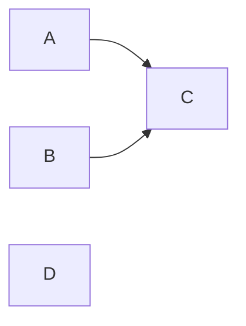

# Migrations
A dependency-graph migration runner for Swift.

## Rationale
Some app migrations have to finish synchronously at launch, others can run in the background, and they often depend on each other. This library handles both cases.

## Details

The library comes with two protocols, one for synchronous and one for asynchronous migrations.
```swift
public protocol SyncMigration {
  static var id: MigrationID { get }
  static var dependencies: [any SyncMigration.Type] { get }
  func migrate() throws
}

public protocol AsyncMigration {
  static var id: MigrationID { get }
  static var dependencies: [any AsyncMigration.Type] { get }
  func migrate() async throws
}
```
A `SyncMigration` can run before any async context exists, e.g. in your app's `init`. An `AsyncMigration` can do async work. Dependencies are checked at compile time: a migration can only depend on migrations of the same kind.

Migrations are executed by one of two runners:
```swift
public struct SyncMigrator {
  public init(store: some MigrationStore)
  public mutating func register(_ migration: some SyncMigration)
  @discardableResult public func run() -> [MigrationID: MigrationOutcome]
}

public struct AsyncMigrator: ~Copyable {
  public init(store: some MigrationStore)
  public mutating func register<Migration: AsyncMigration & SendableMetatype>(
    _ migration: consuming sending Migration
  )
  @discardableResult public consuming func run() async -> [MigrationID: MigrationOutcome]
}
```
Both order migrations with Kahn's algorithm ([Topological sorting of large networks](https://doi.org/10.1145/368996.369025), 1962). For four migrations registered as `A`, `B`, `C`, `D`, where `C` depends on `A` and `B`:



- `SyncMigrator` runs one migration at a time: `A`, `B`, `D`, `C`.
- `AsyncMigrator` runs migrations concurrently: `A`, `B` and `D` start immediately, `C` starts once `A` and `B` have finished.

- Parameters:
  - `store`: Records which migrations have already run.
  - `migration`: The migration to register.
- Returns: The outcome of every registered migration, keyed by its `id`.

A failing migration doesn't stop the run. Only migrations that depend on it are skipped. The possible outcomes are `.succeeded`, `.failed(any Error)`, `.skipped(.alreadyRun)` and `.skipped(.dependencyFailed(MigrationID))`. A failed migration isn't marked as run, so it's retried on the next launch.

> [!CAUTION]
> Cycles, dependencies on unregistered migrations and duplicate `id`s are programmer errors. `run()` traps instead of throwing.

> [!IMPORTANT]
> Run your migrations once per process, from app-level code such as your `App`'s `init` or app delegate, not from a view's `.task`. Two migrators running the same migration against the same storage at the same time will both run it. This includes separate `AppStorageMigrationStore()` instances, since they share `UserDefaults.standard`, and an app and its extensions sharing an App Group.

### Store
`MigrationStore` persists which migrations have already run. The library ships with `AppStorageMigrationStore`, which is backed by `UserDefaults`.
```swift
public protocol MigrationStore {
  func hasRun(_ id: MigrationID) -> Bool
  func markAsRun(_ id: MigrationID)
}

public final class AppStorageMigrationStore: MigrationStore {
  public init(userDefaults: UserDefaults = .standard)
}
```

## Examples

### Sync
```swift
struct EnableNewAccountSystem: SyncMigration {
  static let id = MigrationID("EnableNewAccountSystem")
  func migrate() throws { /* ... */ }
}

struct ClearLegacySessionCache: SyncMigration {
  static let id = MigrationID("ClearLegacySessionCache")
  static var dependencies: [any SyncMigration.Type] { [EnableNewAccountSystem.self] }
  func migrate() throws { /* ... */ }
}

var migrator = SyncMigrator(store: AppStorageMigrationStore())
migrator.register(EnableNewAccountSystem())
migrator.register(ClearLegacySessionCache())
migrator.run()
```
`ClearLegacySessionCache` only runs after `EnableNewAccountSystem` succeeded, regardless of registration order.

### Async
```swift
struct BackfillAvatars: AsyncMigration {
  static let id = MigrationID("BackfillAvatars")
  func migrate() async throws { /* ... */ }
}

Task {
  var migrator = AsyncMigrator(store: AppStorageMigrationStore())
  migrator.register(BackfillAvatars())
  let outcomes = await migrator.run()
  if case .failed(let error) = outcomes[BackfillAvatars.id] {
    // Log the error
  }
}
```
